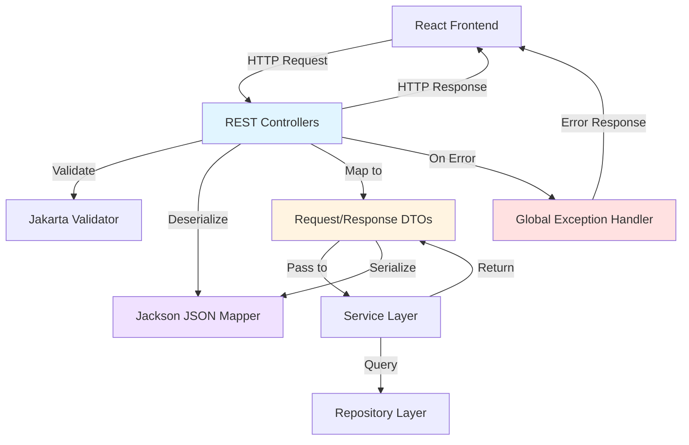

# Design Document: API Compatibility Layer

## Overview

This design implements a REST API compatibility layer that ensures the React frontend can operate seamlessly with both the legacy Node.js backend and the new Java Spring Boot backend during the migration period. The compatibility layer guarantees exact endpoint path matching, request/response format compatibility, HTTP status code alignment, and error response format consistency.

The design follows Spring Boot best practices with constructor injection, package-private visibility, and proper separation of concerns between controllers, services, and repositories. The implementation uses Jackson for JSON serialization, Jakarta Validation for request validation, and Spring Security for authentication.

Key design goals:

- Maintain 100% backward compatibility with Node.js Express API endpoints
- Ensure identical JSON request/response structures using Jackson configuration
- Preserve HTTP status codes and error response formats
- Support zero-downtime migration with both backends running simultaneously
- Enable gradual traffic migration from Node.js to Java backend
- Provide clear observability for compatibility issues

## Architecture

### Component Overview

### Request Processing Flow

1. **Request Reception**: Spring MVC receives HTTP request and routes to appropriate controller method
2. **Deserialization**: Jackson deserializes JSON request body to Request DTO using cam