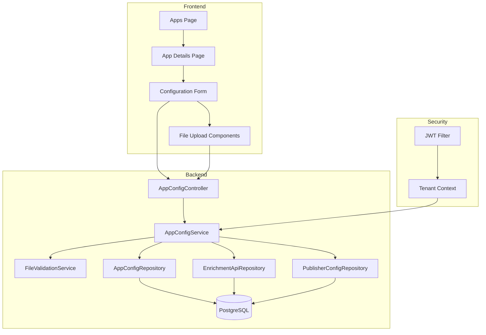

# Design Document: App Configuration Management

## Overview

This feature adds comprehensive configuration management capabilities to the Apps section, enabling users to configure data sources, enrichment APIs, parameters, models, and publishers through a dedicated app details page. The design follows a multi-tenant architecture with JWT-based authentication and supports multiple file formats (JSON, CSV, Avro schema, properties files).

The configuration system is designed to be flexible and extensible, supporting complex nested structures for enrichment APIs and publishers. All configuration data is stored in a normalized relational schema with proper tenant isolation.

## Architecture

### High-Level Architecture



### Component Responsibilities

1. **AppConfigController**: REST API endpoints for configuration CRUD operations
2. **AppConfigService**: Business logic for configuration management, validation, and persistence
3. **FileValidationService**: Validates uploaded files (JSON, CSV, Avro schema)
4. **AppConfigRepository**: Data access for app configuration
5. **EnrichmentApiRepository**: Data access for enrichment API configurations
6. **PublisherConfigRepository**: Data access for publisher configurations
7. **App Details Page**: React component for configuration UI
8. **File Upload Components**: Reusable file upload components with validation

## Components and Interfaces

### Backend Components

#### REST API Endpoints

```
GET    /api/v1/apps/{appId}/config
POST   /api/v1/apps/{appId}/config
PUT    /api/v1/apps/{appId}/config
DELETE /api/v1/apps/{appId}/config/enrichment-apis/{enrichmentApiId}
DELETE /api/v1/apps/{appId}/config/publisher
```

#### Request DTOs

```java
// CreateAppConfigRequest.java
public record CreateAppConfigRequest(
    @NotNull(message = "Source is required")
    @Pattern(regexp = "^(eeh|api)$", message = "Source must be 'eeh' or 'api'")
    String source,
    
    List<EnrichmentApiConfigRequest> enrichmentApis,
    
    @Valid
    ParametersFileRequest parametersFile,
    
    @Valid
    ModelFileRequest modelFile,
    
    @Valid
    PublisherConfigRequest publisher
) {}

// EnrichmentApiConfigRequest.java
public record EnrichmentApiConfigRequest(
    @NotNull(message = "OpenAPI document is required")
    String openApiDocument,  // JSON string
    
    String requestMappings,  // pipe-separated mappings
    
    Map<String, String> configProperties
) {}

// PublisherConfigRequest.java
public record PublisherConfigRequest(
    @NotNull(message = "Publisher type is required")
    @Pattern(regexp = "^(api|eeh)$", message = "Publisher type must be 'api' or 'eeh'")
    String type,
    
    String openApiDocument,  // For API publisher
    
    String requestMappings,  // For API publisher
    
    Map<String, String> configProperties,  // For API publisher
    
    @Valid
    WarehousePublisherRequest warehousePublisher  // For EEH publisher
) {}

// WarehousePublisherRequest.java
public record WarehousePublisherRequest(
    @NotNull(message = "Avro schema is required")
    String avroSchema,  // JSON string
    
    String mappings  // pipe-separated mappings in "source -> target" format
) {}

// ParametersFileRequest.java
public record ParametersFileRequest(
    @NotNull(message = "Filename is required")
    String filename,
    
    @NotNull(message = "Content is required")
    String content  // CSV content as string
) {}

// ModelFileRequest.java
public record ModelFileRequest(
    @NotNull(message = "Filename is required")
    String filename,
    
    @NotNull(message = "Content is required")
    String content  // CSV content as string
) {}
```

#### Response DTOs

```java
// AppConfigResponse.java
public record AppConfigResponse(
    UUID id,
    UUID appId,
    String source,
    List<EnrichmentApiConfigResponse> enrichmentApis,
    ParametersFileResponse parametersFile,
    ModelFileResponse modelFile,
    PublisherConfigResponse publisher,
    LocalDateTime createdAt,
    LocalDateTime updatedAt
) {}

// EnrichmentApiConfigResponse.java
public record EnrichmentApiConfigResponse(
    UUID id,
    String openApiDocument,
    String requestMappings,
    Map<String, String> configProperties
) {}

// PublisherConfigResponse.java
public record PublisherConfigResponse(
    UUID id,
    String type,
    String openApiDocument,
    String requestMappings,
    Map<String, String> configProperties,
    WarehousePublisherResponse warehousePublisher
) {}

// WarehousePublisherResponse.java
public record WarehousePublisherResponse(
    UUID id,
    String avroSchema,
    String mappings
) {}

// ParametersFileResponse.java
public record ParametersFileResponse(
    String filename,
    String content
) {}

// ModelFileResponse.java
public record ModelFileResponse(
    String filename,
    String content
) {}
```

#### Service Layer

```java
public interface AppConfigService {
    AppConfigResponse getConfig(UUID appId);
    AppConfigResponse createConfig(UUID appId, CreateAppConfigRequest request);
    AppConfigResponse updateConfig(UUID appId, CreateAppConfigRequest request);
    void deleteEnrichmentApi(UUID appId, UUID enrichmentApiId);
    void deletePublisher(UUID appId);
}

public interface FileValidationService {
    void validateOpenApiDocument(String jsonContent);
    void validateAvroSchema(String jsonContent);
    void validateCsvContent(String csvContent);
    void validateRequestMappings(String mappings);
}
```

### Frontend Components

#### App Details Page

```jsx
// AppDetail.jsx
const AppDetail = () => {
  const { appId } = useParams();
  const [config, setConfig] = useState(null);
  const [loading, setLoading] = useState(true);
  const [errors, setErrors] = useState({});
  
  // Load configuration
  // Handle form submission
  // Handle file uploads
  // Handle enrichment API add/remove
  
  return (
    <div className="app-detail">
      <h1>{app.name} Configuration</h1>
      
      <SourceSelector value={config.source} onChange={handleSourceChange} />
      
      <EnrichmentApiSection 
        enrichmentApis={config.enrichmentApis}
        onAdd={handleAddEnrichmentApi}
        onRemove={handleRemoveEnrichmentApi}
        onUpdate={handleUpdateEnrichmentApi}
      />
      
      <FileUploadSection
        label="Parameters File"
        accept=".csv"
        file={config.parametersFile}
        onUpload={handleParametersUpload}
      />
      
      <FileUploadSection
        label="Model File"
        accept=".csv"
        file={config.modelFile}
        onUpload={handleModelUpload}
      />
      
      <PublisherSection
        publisher={config.publisher}
        onChange={handlePublisherChange}
      />
      
      <button onClick={handleSave}>Save Configuration</button>
    </div>
  );
};
```

#### Reusable Components

```jsx
// SourceSelector.jsx
const SourceSelector = ({ value, onChange }) => {
  return (
    <select value={value} onChange={onChange}>
      <option value="">Select source...</option>
      <option value="eeh">EEH</option>
      <option value="api">API</option>
    </select>
  );
};

// EnrichmentApiSection.jsx
const EnrichmentApiSection = ({ enrichmentApis, onAdd, onRemove, onUpdate }) => {
  return (
    <div className="enrichment-api-section">
      <h2>Enrichment APIs</h2>
      {enrichmentApis.map((api, index) => (
        <EnrichmentApiEntry
          key={api.id || index}
          api={api}
          onUpdate={(updated) => onUpdate(index, updated)}
          onRemove={() => onRemove(index)}
        />
      ))}
      <button onClick={onAdd}>Add Enrichment API</button>
    </div>
  );
};

// EnrichmentApiEntry.jsx
const EnrichmentApiEntry = ({ api, onUpdate, onRemove }) => {
  return (
    <div className="enrichment-api-entry">
      <FileUpload
        label="OpenAPI Document"
        accept=".json"
        file={api.openApiDocument}
        onUpload={(file) => onUpdate({ ...api, openApiDocument: file })}
      />
      
      <TextArea
        label="Request Mappings"
        placeholder="source1 -> target1 | source2 -> target2"
        value={api.requestMappings}
        onChange={(e) => onUpdate({ ...api, requestMappings: e.target.value })}
      />
      
      <KeyValueEditor
        label="Configuration Properties"
        values={api.configProperties}
        onChange={(props) => onUpdate({ ...api, configProperties: props })}
      />
      
      <button onClick={onRemove}>Remove</button>
    </div>
  );
};

// PublisherSection.jsx
const PublisherSection = ({ publisher, onChange }) => {
  const [type, setType] = useState(publisher?.type || '');
  
  const handleTypeChange = (newType) => {
    setType(newType);
    onChange({ ...publisher, type: newType });
  };
  
  return (
    <div className="publisher-section">
      <h2>Publisher Configuration</h2>
      
      <select value={type} onChange={(e) => handleTypeChange(e.target.value)}>
        <option value="">Select publisher type...</option>
        <option value="api">API</option>
        <option value="eeh">EEH</option>
      </select>
      
      {type === 'api' && (
        <ApiPublisherConfig publisher={publisher} onChange={onChange} />
      )}
      
      {type === 'eeh' && (
        <EehPublisherConfig publisher={publisher} onChange={onChange} />
      )}
    </div>
  );
};

// FileUpload.jsx
const FileUpload = ({ label, accept, file, onUpload, error }) => {
  const handleFileChange = async (e) => {
    const selectedFile = e.target.files[0];
    if (!selectedFile) return;
    
    const content = await selectedFile.text();
    onUpload({ filename: selectedFile.name, content });
  };
  
  return (
    <div className="file-upload">
      <label>{label}</label>
      <input type="file" accept={accept} onChange={handleFileChange} />
      {file && <span className="filename">{file.filename}</span>}
      {error && <span className="error">{error}</span>}
    </div>
  );
};
```

## Data Models

### Database Schema

#### app_configurations Table

```sql
CREATE TABLE app_configurations (
    id UUID PRIMARY KEY DEFAULT gen_random_uuid(),
    tenant_id UUID NOT NULL,
    app_id UUID NOT NULL,
    source VARCHAR(10) NOT NULL CHECK (source IN ('eeh', 'api')),
    parameters_filename VARCHAR(255),
    parameters_content TEXT,
    model_filename VARCHAR(255),
    model_content TEXT,
    created_at TIMESTAMP NOT NULL DEFAULT NOW(),
    updated_at TIMESTAMP NOT NULL DEFAULT NOW(),
    CONSTRAINT fk_app_config_tenant FOREIGN KEY (tenant_id) REFERENCES tenants(id) ON DELETE CASCADE,
    CONSTRAINT fk_app_config_app FOREIGN KEY (app_id) REFERENCES apps(id) ON DELETE CASCADE,
    CONSTRAINT unique_config_per_app UNIQUE (app_id)
);

CREATE INDEX idx_app_config_tenant_id ON app_configurations(tenant_id);
CREATE INDEX idx_app_config_app_id ON app_configurations(app_id);
```

#### enrichment_api_configs Table

```sql
CREATE TABLE enrichment_api_configs (
    id UUID PRIMARY KEY DEFAULT gen_random_uuid(),
    tenant_id UUID NOT NULL,
    app_config_id UUID NOT NULL,
    openapi_document TEXT NOT NULL,
    request_mappings TEXT,
    config_properties JSONB,
    created_at TIMESTAMP NOT NULL DEFAULT NOW(),
    updated_at TIMESTAMP NOT NULL DEFAULT NOW(),
    CONSTRAINT fk_enrichment_api_tenant FOREIGN KEY (tenant_id) REFERENCES tenants(id) ON DELETE CASCADE,
    CONSTRAINT fk_enrichment_api_config FOREIGN KEY (app_config_id) REFERENCES app_configurations(id) ON DELETE CASCADE
);

CREATE INDEX idx_enrichment_api_tenant_id ON enrichment_api_configs(tenant_id);
CREATE INDEX idx_enrichment_api_config_id ON enrichment_api_configs(app_config_id);
```

#### publisher_configs Table

```sql
CREATE TABLE publisher_configs (
    id UUID PRIMARY KEY DEFAULT gen_random_uuid(),
    tenant_id UUID NOT NULL,
    app_config_id UUID NOT NULL,
    type VARCHAR(10) NOT NULL CHECK (type IN ('api', 'eeh')),
    openapi_document TEXT,
    request_mappings TEXT,
    config_properties JSONB,
    created_at TIMESTAMP NOT NULL DEFAULT NOW(),
    updated_at TIMESTAMP NOT NULL DEFAULT NOW(),
    CONSTRAINT fk_publisher_config_tenant FOREIGN KEY (tenant_id) REFERENCES tenants(id) ON DELETE CASCADE,
    CONSTRAINT fk_publisher_config_app_config FOREIGN KEY (app_config_id) REFERENCES app_configurations(id) ON DELETE CASCADE,
    CONSTRAINT unique_publisher_per_app_config UNIQUE (app_config_id)
);

CREATE INDEX idx_publisher_config_tenant_id ON publisher_configs(tenant_id);
CREATE INDEX idx_publisher_config_app_config_id ON publisher_configs(app_config_id);
```

#### warehouse_publisher_configs Table

```sql
CREATE TABLE warehouse_publisher_configs (
    id UUID PRIMARY KEY DEFAULT gen_random_uuid(),
    tenant_id UUID NOT NULL,
    publisher_config_id UUID NOT NULL,
    avro_schema TEXT NOT NULL,
    mappings TEXT,
    created_at TIMESTAMP NOT NULL DEFAULT NOW(),
    updated_at TIMESTAMP NOT NULL DEFAULT NOW(),
    CONSTRAINT fk_warehouse_publisher_tenant FOREIGN KEY (tenant_id) REFERENCES tenants(id) ON DELETE CASCADE,
    CONSTRAINT fk_warehouse_publisher_config FOREIGN KEY (publisher_config_id) REFERENCES publisher_configs(id) ON DELETE CASCADE,
    CONSTRAINT unique_warehouse_per_publisher UNIQUE (publisher_config_id)
);

CREATE INDEX idx_warehouse_publisher_tenant_id ON warehouse_publisher_configs(tenant_id);
CREATE INDEX idx_warehouse_publisher_config_id ON warehouse_publisher_configs(publisher_config_id);
```

### JPA Entities

```java
@Entity
@Table(name = "app_configurations")
@Data
public class AppConfiguration {
    @Id
    @GeneratedValue(strategy = GenerationType.UUID)
    private UUID id;
    
    @Column(name = "tenant_id", nullable = false)
    private UUID tenantId;
    
    @Column(name = "app_id", nullable = false)
    private UUID appId;
    
    @Column(nullable = false)
    private String source;
    
    @Column(name = "parameters_filename")
    private String parametersFilename;
    
    @Column(name = "parameters_content", columnDefinition = "TEXT")
    private String parametersContent;
    
    @Column(name = "model_filename")
    private String modelFilename;
    
    @Column(name = "model_content", columnDefinition = "TEXT")
    private String modelContent;
    
    @OneToMany(mappedBy = "appConfiguration", cascade = CascadeType.ALL, orphanRemoval = true)
    private List<EnrichmentApiConfig> enrichmentApis = new ArrayList<>();
    
    @OneToOne(mappedBy = "appConfiguration", cascade = CascadeType.ALL, orphanRemoval = true)
    private PublisherConfig publisher;
    
    @Column(name = "created_at", nullable = false, updatable = false)
    private LocalDateTime createdAt;
    
    @Column(name = "updated_at", nullable = false)
    private LocalDateTime updatedAt;
    
    @PrePersist
    protected void onCreate() {
        createdAt = LocalDateTime.now();
        updatedAt = LocalDateTime.now();
    }
    
    @PreUpdate
    protected void onUpdate() {
        updatedAt = LocalDateTime.now();
    }
}

@Entity
@Table(name = "enrichment_api_configs")
@Data
public class EnrichmentApiConfig {
    @Id
    @GeneratedValue(strategy = GenerationType.UUID)
    private UUID id;
    
    @Column(name = "tenant_id", nullable = false)
    private UUID tenantId;
    
    @ManyToOne(fetch = FetchType.LAZY)
    @JoinColumn(name = "app_config_id", nullable = false)
    private AppConfiguration appConfiguration;
    
    @Column(name = "openapi_document", nullable = false, columnDefinition = "TEXT")
    private String openApiDocument;
    
    @Column(name = "request_mappings", columnDefinition = "TEXT")
    private String requestMappings;
    
    @Column(name = "config_properties", columnDefinition = "JSONB")
    @Convert(converter = JsonbConverter.class)
    private Map<String, String> configProperties;
    
    @Column(name = "created_at", nullable = false, updatable = false)
    private LocalDateTime createdAt;
    
    @Column(name = "updated_at", nullable = false)
    private LocalDateTime updatedAt;
    
    @PrePersist
    protected void onCreate() {
        createdAt = LocalDateTime.now();
        updatedAt = LocalDateTime.now();
    }
    
    @PreUpdate
    protected void onUpdate() {
        updatedAt = LocalDateTime.now();
    }
}

@Entity
@Table(name = "publisher_configs")
@Data
public class PublisherConfig {
    @Id
    @GeneratedValue(strategy = GenerationType.UUID)
    private UUID id;
    
    @Column(name = "tenant_id", nullable = false)
    private UUID tenantId;
    
    @OneToOne(fetch = FetchType.LAZY)
    @JoinColumn(name = "app_config_id", nullable = false)
    private AppConfiguration appConfiguration;
    
    @Column(nullable = false)
    private String type;
    
    @Column(name = "openapi_document", columnDefinition = "TEXT")
    private String openApiDocument;
    
    @Column(name = "request_mappings", columnDefinition = "TEXT")
    private String requestMappings;
    
    @Column(name = "config_properties", columnDefinition = "JSONB")
    @Convert(converter = JsonbConverter.class)
    private Map<String, String> configProperties;
    
    @OneToOne(mappedBy = "publisherConfig", cascade = CascadeType.ALL, orphanRemoval = true)
    private WarehousePublisherConfig warehousePublisher;
    
    @Column(name = "created_at", nullable = false, updatable = false)
    private LocalDateTime createdAt;
    
    @Column(name = "updated_at", nullable = false)
    private LocalDateTime updatedAt;
    
    @PrePersist
    protected void onCreate() {
        createdAt = LocalDateTime.now();
        updatedAt = LocalDateTime.now();
    }
    
    @PreUpdate
    protected void onUpdate() {
        updatedAt = LocalDateTime.now();
    }
}

@Entity
@Table(name = "warehouse_publisher_configs")
@Data
public class WarehousePublisherConfig {
    @Id
    @GeneratedValue(strategy = GenerationType.UUID)
    private UUID id;
    
    @Column(name = "tenant_id", nullable = false)
    private UUID tenantId;
    
    @OneToOne(fetch = FetchType.LAZY)
    @JoinColumn(name = "publisher_config_id", nullable = false)
    private PublisherConfig publisherConfig;
    
    @Column(name = "avro_schema", nullable = false, columnDefinition = "TEXT")
    private String avroSchema;
    
    @Column(columnDefinition = "TEXT")
    private String mappings;
    
    @Column(name = "created_at", nullable = false, updatable = false)
    private LocalDateTime createdAt;
    
    @Column(name = "updated_at", nullable = false)
    private LocalDateTime updatedAt;
    
    @PrePersist
    protected void onCreate() {
        createdAt = LocalDateTime.now();
        updatedAt = LocalDateTime.now();
    }
    
    @PreUpdate
    protected void onUpdate() {
        updatedAt = LocalDateTime.now();
    }
}
```

### JSONB Converter

```java
@Converter
public class JsonbConverter implements AttributeConverter<Map<String, String>, String> {
    
    private final ObjectMapper objectMapper = new ObjectMapper();
    
    @Override
    public String convertToDatabaseColumn(Map<String, String> attribute) {
        if (attribute == null || attribute.isEmpty()) {
            return null;
        }
        try {
            return objectMapper.writeValueAsString(attribute);
        } catch (JsonProcessingException e) {
            throw new IllegalArgumentException("Error converting map to JSON", e);
        }
    }
    
    @Override
    public Map<String, String> convertToEntityAttribute(String dbData) {
        if (dbData == null || dbData.isEmpty()) {
            return new HashMap<>();
        }
        try {
            return objectMapper.readValue(dbData, new TypeReference<Map<String, String>>() {});
        } catch (JsonProcessingException e) {
            throw new IllegalArgumentException("Error converting JSON to map", e);
        }
    }
}
```


## Correctness Properties

A property is a characteristic or behavior that should hold true across all valid executions of a system-essentially, a formal statement about what the system should do. Properties serve as the bridge between human-readable specifications and machine-verifiable correctness guarantees.

### Property 1: Configuration Retrieval

For any app ID belonging to the authenticated tenant, the system should retrieve and return the associated configuration data.

**Validates: Requirements 1.4, 11.1**

### Property 2: Source Selection Persistence

For any valid source selection ("eeh" or "api"), when stored, the configuration should persist the selected source value.

**Validates: Requirements 2.3**

### Property 3: Source Validation

For any configuration save attempt, if no source is selected, the validation should fail with an appropriate error message.

**Validates: Requirements 2.4**

### Property 4: Multiple Enrichment APIs

For any number of enrichment API entries added to a configuration, the system should accept and store all entries.

**Validates: Requirements 3.2**

### Property 5: OpenAPI Document Validation

For any uploaded file claiming to be an OpenAPI document, if it does not conform to the OpenAPI specification, the validation should reject it with a specific error message.

**Validates: Requirements 3.4, 6.4**

### Property 6: Request Mappings Storage Format

For any request mappings entered (for enrichment APIs or publishers), the stored format should be valid request-mappings.properties format with proper "source -> target" syntax.

**Validates: Requirements 3.6, 6.6**

### Property 7: Configuration Properties Storage Format

For any configuration properties entered (for enrichment APIs or publishers), the stored format should be valid config.properties format as key-value pairs.

**Validates: Requirements 3.8, 6.8**

### Property 8: Enrichment API Removal

For any enrichment API entry in a configuration, the system should allow removal and update the configuration accordingly.

**Validates: Requirements 3.9**

### Property 9: CSV File Acceptance and Validation

For any uploaded file for parameters or models, if it is valid CSV format, the system should accept it; if invalid, the system should reject it with a format-specific error.

**Validates: Requirements 4.2, 4.3, 5.2, 5.3**

### Property 10: File Content Persistence

For any valid file uploaded (parameters, model, OpenAPI, Avro schema), the system should persist the file content and filename to the database.

**Validates: Requirements 4.4, 5.4**

### Property 11: File Replacement

For any existing uploaded file (parameters or model), the system should allow replacement with a new file, updating both content and filename.

**Validates: Requirements 4.6, 5.6**

### Property 12: Avro Schema Validation

For any uploaded file claiming to be an Avro schema, if it is not valid Avro schema format (which includes being valid JSON), the validation should reject it with a specific error message.

**Validates: Requirements 7.4, 7.7**

### Property 13: Warehouse Publisher Mappings Storage

For any warehouse publisher mappings entered in "source -> target" format, the stored format should be valid mappings.properties format.

**Validates: Requirements 7.6**

### Property 14: Configuration Validation Before Save

For any configuration data submitted for saving, the system should validate all fields and either accept the entire configuration or reject it with field-specific error messages.

**Validates: Requirements 8.2, 8.3**

### Property 15: Configuration Persistence

For any valid configuration data, when saved successfully, all configuration changes should be persisted to the database atomically.

**Validates: Requirements 8.4**

### Property 16: Timestamp Update on Save

For any successful configuration save, the app's updated_at timestamp should be set to the current time.

**Validates: Requirements 8.6**

### Property 17: Invalid Format Error Messages

For any uploaded file with an invalid format, the error message should specify the expected format.

**Validates: Requirements 9.2**

### Property 18: JSON Parsing Error Details

For any malformed JSON file uploaded, the error message should include the parsing error location.

**Validates: Requirements 9.3**

### Property 19: CSV Structure Error Details

For any CSV file with invalid structure, the error message should include row and column information.

**Validates: Requirements 9.4**

### Property 20: Request Mapping Format Validation

For any request mapping entry, if it does not follow the "source -> target" format, the validation should reject it with an error indicating the correct format.

**Validates: Requirements 10.1, 10.2**

### Property 21: Field Name Character Validation

For any source or target field name in request mappings, if it contains characters other than alphanumeric, dots, or underscores, the validation should reject it.

**Validates: Requirements 10.3**

### Property 22: Pipe-Separated Mappings Parsing

For any request mappings string containing pipe characters, the system should parse and store each mapping entry separately.

**Validates: Requirements 10.4**

### Property 23: Whitespace Trimming

For any source or target field names in request mappings, the stored values should have leading and trailing whitespace removed.

**Validates: Requirements 10.5**

### Property 24: Tenant Isolation

For any configuration operation (create, read, update, delete), the system should only allow access to configurations where the app's tenant_id matches the authenticated user's tenant_id from the JWT token.

**Validates: Requirements 12.1, 12.2, 12.3, 12.4**

## Error Handling

### Validation Errors

The system uses Jakarta Bean Validation annotations on request DTOs to enforce constraints. Validation errors are caught by the global exception handler and returned as structured error responses:

```java
@RestControllerAdvice
public class GlobalExceptionHandler {
    
    @ExceptionHandler(MethodArgumentNotValidException.class)
    public ResponseEntity<ErrorResponse> handleValidationErrors(MethodArgumentNotValidException ex) {
        Map<String, String> errors = new HashMap<>();
        ex.getBindingResult().getFieldErrors().forEach(error -> 
            errors.put(error.getField(), error.getDefaultMessage())
        );
        return ResponseEntity.badRequest().body(new ErrorResponse("Validation failed", errors));
    }
    
    @ExceptionHandler(FileValidationException.class)
    public ResponseEntity<ErrorResponse> handleFileValidationError(FileValidationException ex) {
        return ResponseEntity.badRequest().body(
            new ErrorResponse("File validation failed", Map.of("file", ex.getMessage()))
        );
    }
    
    @ExceptionHandler(ConfigurationNotFoundException.class)
    public ResponseEntity<ErrorResponse> handleConfigurationNotFound(ConfigurationNotFoundException ex) {
        return ResponseEntity.status(HttpStatus.NOT_FOUND).body(
            new ErrorResponse("Configuration not found", Map.of("appId", ex.getMessage()))
        );
    }
    
    @ExceptionHandler(UnauthorizedAccessException.class)
    public ResponseEntity<ErrorResponse> handleUnauthorizedAccess(UnauthorizedAccessException ex) {
        return ResponseEntity.status(HttpStatus.FORBIDDEN).body(
            new ErrorResponse("Access denied", Map.of("reason", ex.getMessage()))
        );
    }
}
```

### File Upload Errors

File validation errors include specific details to help users correct issues:

- **Size limit exceeded**: "File size exceeds maximum limit of 10MB"
- **Invalid JSON**: "Invalid JSON at line 5, column 12: Expected '}' but found ','"
- **Invalid CSV**: "Invalid CSV structure at row 3, column 2: Missing closing quote"
- **Invalid OpenAPI**: "Invalid OpenAPI document: Missing required field 'openapi' in root object"
- **Invalid Avro schema**: "Invalid Avro schema: Field 'type' must be one of [null, boolean, int, long, float, double, bytes, string, record, enum, array, map, union, fixed]"

### Request Mapping Errors

Request mapping validation provides clear feedback:

- **Invalid format**: "Request mapping must follow format 'source -> target', found: 'invalid_mapping'"
- **Invalid characters**: "Field name 'user-name' contains invalid characters. Only alphanumeric, dots, and underscores are allowed"
- **Empty fields**: "Source and target field names cannot be empty"

### Tenant Isolation Errors

When a user attempts to access a configuration for an app belonging to another tenant:

```json
{
  "message": "Access denied",
  "errors": {
    "reason": "App does not belong to your tenant"
  }
}
```

## Testing Strategy

### Unit Testing

Unit tests focus on specific components in isolation:

1. **Service Layer Tests**
   - Test AppConfigService methods with mocked repositories
   - Test FileValidationService with various valid and invalid inputs
   - Test request mapping parsing and validation logic
   - Test tenant isolation enforcement

2. **Controller Tests**
   - Test REST endpoints with MockMvc
   - Test request validation with invalid DTOs
   - Test error response formats
   - Test authentication and authorization

3. **Repository Tests**
   - Test CRUD operations with H2 in-memory database
   - Test cascade delete behavior
   - Test unique constraints
   - Test tenant filtering queries

4. **Validation Tests**
   - Test OpenAPI document validation with valid and invalid documents
   - Test Avro schema validation with valid and invalid schemas
   - Test CSV validation with various edge cases
   - Test request mapping format validation

### Property-Based Testing

Property-based tests verify universal properties across randomized inputs using jqwik. Each test runs a minimum of 100 iterations.

1. **Configuration Persistence Properties**
   - Generate random valid configurations and verify round-trip persistence
   - Tag: **Feature: app-configuration-management, Property 15: Configuration Persistence**

2. **File Validation Properties**
   - Generate random valid/invalid JSON, CSV, and Avro files
   - Verify validation accepts valid files and rejects invalid ones
   - Tag: **Feature: app-configuration-management, Property 5: OpenAPI Document Validation**
   - Tag: **Feature: app-configuration-management, Property 9: CSV File Acceptance and Validation**
   - Tag: **Feature: app-configuration-management, Property 12: Avro Schema Validation**

3. **Request Mapping Properties**
   - Generate random request mappings with various formats
   - Verify parsing, validation, and storage format
   - Tag: **Feature: app-configuration-management, Property 20: Request Mapping Format Validation**
   - Tag: **Feature: app-configuration-management, Property 22: Pipe-Separated Mappings Parsing**
   - Tag: **Feature: app-configuration-management, Property 23: Whitespace Trimming**

4. **Tenant Isolation Properties**
   - Generate random tenant IDs and app IDs
   - Verify cross-tenant access is always denied
   - Tag: **Feature: app-configuration-management, Property 24: Tenant Isolation**

5. **Timestamp Update Properties**
   - Generate random configurations and verify timestamp updates
   - Tag: **Feature: app-configuration-management, Property 16: Timestamp Update on Save**

### Integration Testing

Integration tests verify end-to-end functionality:

1. **Full Configuration Workflow**
   - Create app, create configuration, update configuration, retrieve configuration
   - Verify all data is persisted correctly
   - Verify tenant isolation throughout workflow

2. **File Upload Workflow**
   - Upload files through REST API
   - Verify file content is stored and retrievable
   - Verify file replacement works correctly

3. **Multi-Tenant Scenarios**
   - Create configurations for multiple tenants
   - Verify each tenant can only access their own configurations
   - Verify tenant deletion cascades to configurations

### Frontend Testing

1. **Component Tests**
   - Test file upload components with various file types
   - Test form validation and error display
   - Test enrichment API add/remove functionality
   - Test publisher type switching

2. **Integration Tests**
   - Test navigation from Apps page to App Details page
   - Test configuration save and reload
   - Test error handling and display

### Test Configuration

All property-based tests use jqwik with the following configuration:

```java
@Property(tries = 100)
void propertyTest(@ForAll("generator") TestData data) {
    // Test implementation
}
```

Unit tests use JUnit 5 with Spring Boot Test and Mockito for mocking. Integration tests use @SpringBootTest with H2 in-memory database and Testcontainers for PostgreSQL when needed.
