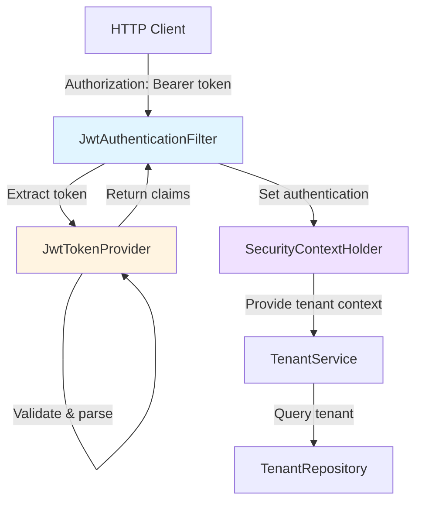

# Design Document: JWT Authentication Migration

## Overview

This design implements JWT-based authentication for the Spring Boot backend, migrating from the legacy Node.js
implementation while maintaining backward compatibility. The system currently stores passwords in plain text and
returns tenant IDs as strings instead of JWT tokens - a critical security vulnerability that must be addressed.

The design follows Spring Security best practices with a stateless authentication filter that validates JWT tokens
on every request. The implementation uses the JJWT library (version 0.12.5) for token generation and validation,
with HS256 signing algorithm and 7-day token expiration matching the legacy behavior.

Key design goals:

- Maintain 100% backward compatibility with existing JWT tokens from Node.js backend
- Implement proper password hashing using BCrypt (replacing plain text storage)
- Integrate seamlessly with Spring Security framework
- Support thread-safe, stateless authentication suitable for horizontal scaling
- Provide clear error handling and observability for authentication failures

## Architecture

### Component Overview



### Authentication Flow

1. **Request Interception**: JwtAuthenticationFilter intercepts all HTTP requests before controller execution
2. **Token Extraction**: Filter extracts Bearer token from Authorization header
3. **Token Validation**: JwtTokenProvider validates signature, expiration, and structure
4. **Context Population**: Filter creates Spring Security authentication object and stores in SecurityContext
5. **Request Processing**: Controller accesses authenticated tenant via SecurityContext
6. **Context Cleanup**: Filter clears SecurityContext after request completion

### Security Configuration

The SecurityConfig class configures Spring Security with:

- Stateless session management (no server-side sessions)
- CORS configuration allowing frontend origin
- JWT authentication filter registered before UsernamePasswordAuthenticationFilter
- Public endpoints: /api/auth/login, /api/auth/register, /actuator/health
- Protected endpoints: All other /api/* routes require valid JWT

### Backward Compatibility Strategy

To ensure seamless migration from Node.js to Java backend:

1. **Shared Secret**: Use identical JWT_SECRET environment variable
2. **Token Structure**: Match claim names (tenantId, email, iat, exp)
3. **Algorithm**: Use HS256 signing algorithm
4. **Expiration**: Maintain 7-day token lifetime
5. **Validation**: Accept tokens generated by either backend

## Components and Interfaces

### JwtTokenProvider

Core component responsible for JWT token lifecycle operations.

**Responsibilities:**

- Generate JWT tokens with tenant context
- Validate token signatures and expiration
- Extract claims from valid tokens
- Handle JWT parsing exceptions

**Interface:**

```java
public class JwtTokenProvider {
    public String generateToken(UUID tenantId, String email);
    public boolean validateToken(String token);
    public UUID getTenantIdFromToken(String token);
    public String getEmailFromToken(String token);
}
```

**Configuration:**

- Injected with JWT_SECRET from environment
- Injected with token expiration duration (default 7 days)
- Stateless design - no instance variables except configuration
- Thread-safe for concurrent access

**Implementation Notes:**

- Uses JJWT library Jwts.builder() for token generation
- Uses Jwts.parser() with signing key for validation
- Catches and wraps JJWT exceptions (ExpiredJwtException, MalformedJwtException, SignatureException)
- Logs validation failures at DEBUG level without exposing token contents

### JwtAuthenticationFilter

Spring Security filter that intercepts requests and validates JWT tokens.

**Responsibilities:**

- Extract Bearer token from Authorization header
- Delegate validation to JwtTokenProvider
- Populate SecurityContext with authenticated tenant
- Clear SecurityContext after request completion
- Handle authentication failures gracefully

**Interface:**

```java
public class JwtAuthenticationFilter extends OncePerRequestFilter {
    @Override
    protected void doFilterInternal(
        HttpServletRequest request,
        HttpServletResponse response,
        FilterChain filterChain
    ) throws ServletException, IOException;
    
    private String extractTokenFromRequest(HttpServletRequest request);
}
```

**Filter Behavior:**

- Extends OncePerRequestFilter to ensure single execution per request
- Extracts token from "Authorization: Bearer {token}" header
- Skips authentication if header missing or malformed
- On validation success: creates UsernamePasswordAuthenticationToken with tenant details
- On validation failure: logs error and continues without authentication (lets Spring Security handle 401)
- Always calls filterChain.doFilter() to continue request processing
- Uses try-finally to ensure SecurityContext cleanup

### SecurityConfig

Spring Security configuration class defining authentication and authorization rules.

**Responsibilities:**

- Configure HTTP security with stateless session management
- Register JwtAuthenticationFilter in filter chain
- Define public and protected endpoint patterns
- Configure CORS settings
- Provide JwtTokenProvider as Spring bean

**Configuration:**

```java
@Configuration
@EnableWebSecurity
public class SecurityConfig {
    @Bean
    public SecurityFilterChain filterChain(HttpSecurity http);
    
    @Bean
    public JwtTokenProvider jwtTokenProvider(
        @Value("${jwt.secret}") String secret,
        @Value("${jwt.expiration:604800000}") long expiration
    );
    
    @Bean
    public PasswordEncoder passwordEncoder();
}
```

**Security Rules:**

- Disable CSRF (stateless JWT authentication)
- Disable session creation (STATELESS)
- Permit all: /api/auth/login, /api/auth/register, /actuator/health, /actuator/info
- Require authentication: /api/**
- Add JwtAuthenticationFilter before UsernamePasswordAuthenticationFilter
- Configure CORS to allow frontend origin with credentials

### TenantService Updates

Modifications to existing TenantService to integrate JWT authentication.

**Changes Required:**

1. **Inject JwtTokenProvider**: Add constructor parameter for token generation
2. **Inject PasswordEncoder**: Add constructor parameter for password hashing
3. **Update register()**: Hash password with BCrypt before saving, generate JWT token in response
4. **Update login()**: Validate password with BCrypt, generate JWT token in response
5. **Update getCurrentTenant()**: Remove fallback to default tenant, throw UnauthorizedException if not authenticated
6. **Update completeOnboarding()**: Remove fallback to default tenant, require authentication

**Modified Interface:**

```java
@Service
public class TenantService {
    private final TenantRepository tenantRepository;
    private final JwtTokenProvider jwtTokenProvider;
    private final PasswordEncoder passwordEncoder;
    
    public AuthResponse register(RegisterRequest request);
    public AuthResponse login(LoginRequest request);
    public TenantResponse getCurrentTenant();
    public void completeOnboarding();
}
```

**Security Improvements:**

- Replace plain text password storage with BCrypt hashing
- Generate JWT tokens instead of returning tenant ID strings
- Remove security-disabled fallback logic
- Enforce authentication for all protected operations

### TenantContextHolder Integration

The existing TenantContextHolder will be populated by JwtAuthenticationFilter after successful token validation.

**Usage Pattern:**

```java
// In JwtAuthenticationFilter after validation
UUID tenantId = jwtTokenProvider.getTenantIdFromToken(token);
TenantContextHolder.setTenantId(tenantId);

// In service methods
UUID tenantId = TenantContextHolder.getTenantId();
if (tenantId == null) {
    throw new UnauthorizedException("Authentication required");
}
```

**Thread Safety:**

- TenantContextHolder uses ThreadLocal storage
- Each request thread has isolated tenant context
- Filter clears context in finally block to prevent leaks

## Data Models

### JWT Token Structure

The JWT token consists of three parts: header, payload, and signature.

**Header:**

```json
{
  "alg": "HS256",
  "typ": "JWT"
}
```

**Payload (Claims):**

```json
{
  "tenantId": "550e8400-e29b-41d4-a716-446655440000",
  "email": "user@example.com",
  "iat": 1704067200,
  "exp": 1704672000
}
```

**Claim Definitions:**

- `tenantId` (string): UUID of authenticated tenant in string format
- `email` (string): Tenant email address
- `iat` (number): Issued-at timestamp in Unix epoch seconds
- `exp` (number): Expiration timestamp in Unix epoch seconds (iat + 7 days)

**Signature:**

HMACSHA256(base64UrlEncode(header) + "." + base64UrlEncode(payload), JWT_SECRET)

### AuthResponse DTO

Response object returned from login and register endpoints.

**Current Structure:**

```java
public record AuthResponse(
    TenantResponse tenant,
    String token
) {}
```

**Updated Structure:**

The token field will change from tenant ID string to JWT token string. No structural changes needed, only the
content of the token field changes.

**Example Response:**

```json
{
  "tenant": {
    "id": "550e8400-e29b-41d4-a716-446655440000",
    "name": "Acme Corp",
    "slug": "acme-corp",
    "email": "admin@acme.com",
    "features": {},
    "onboardingCompleted": false
  },
  "token": "eyJhbGciOiJIUzI1NiIsInR5cCI6IkpXVCJ9..."
}
```

### Tenant Entity Updates

The Tenant entity requires password hashing field update.

**Current Field:**

```java
@Column(name = "password_hash", nullable = false)
private String passwordHash; // Currently stores plain text
```

**Updated Usage:**

The field name remains the same, but the content will be BCrypt hashed passwords instead of plain text. BCrypt
produces 60-character strings in format: `$2a$10$...` (algorithm + cost + salt + hash).

**Migration Consideration:**

Existing plain text passwords in the database will not match BCrypt validation. Options:

1. Force password reset for all users (recommended for security)
2. Detect plain text passwords and hash on first login (migration path)
3. Clear all tenant data and require re-registration (acceptable for development)

For this implementation, we'll use option 3 (clear data) since the system is in development with no production users.

### Spring Security Authentication Object

Spring Security uses Authentication objects to represent authenticated principals.

**Structure:**

```java
UsernamePasswordAuthenticationToken authentication = new UsernamePasswordAuthenticationToken(
    tenantId,           // principal (UUID)
    null,               // credentials (not needed after authentication)
    Collections.emptyList()  // authorities (not using role-based auth yet)
);
authentication.setAuthenticated(true);
```

**Access Pattern:**

```java
// In controller or service
Authentication auth = SecurityContextHolder.getContext().getAuthentication();
UUID tenantId = (UUID) auth.getPrincipal();
```

### Configuration Properties

JWT configuration properties defined in application.properties.

**Properties:**

```properties
# JWT Configuration
jwt.secret=${JWT_SECRET}
jwt.expiration=604800000

# 604800000 ms = 7 days
# Must match Node.js backend expiration
```

**Environment Variables:**

- `JWT_SECRET`: Required. Shared secret key for HS256 signing. Must be at least 256 bits (32 characters).
- `jwt.expiration`: Optional. Token lifetime in milliseconds. Defaults to 7 days.

**Validation:**

SecurityConfig validates JWT_SECRET on startup:

- Check environment variable is set
- Check minimum length (32 characters for HS256)
- Fail fast with clear error message if invalid


## Correctness Properties

A property is a characteristic or behavior that should hold true across all valid executions of a system-essentially,
a formal statement about what the system should do. Properties serve as the bridge between human-readable
specifications and machine-verifiable correctness guarantees.

### Property 1: Token Generation Contains Required Claims

For any valid tenant ID and email, when generating a JWT token, the token payload SHALL contain both the tenant ID
and email as claims with the exact values provided.

**Validates: Requirements 1.1**

### Property 2: Token Structure Conformance

For any generated JWT token, the token SHALL use HS256 algorithm in the header, include an issued-at (iat) timestamp
claim, and use claim names "tenantId" and "email" matching the legacy Node.js format.

**Validates: Requirements 1.2, 1.4, 1.5, 3.2**

### Property 3: Token Expiration is Seven Days

For any generated JWT token, the expiration (exp) claim SHALL be exactly 604800000 milliseconds (7 days) after the
issued-at (iat) claim.

**Validates: Requirements 1.3, 3.3**

### Property 4: Token Round-Trip Preserves Data

For any valid tenant ID and email, generating a JWT token then validating and extracting claims SHALL return the
identical tenant ID and email values (round-trip property).

**Validates: Requirements 2.4, 2.5, 3.4, 3.5**

### Property 5: Invalid Signature Rejection

For any JWT token with a modified signature (tampered token), validation SHALL reject the token and throw a
signature exception.

**Validates: Requirements 2.1, 2.2**

### Property 6: Expired Token Rejection

For any JWT token with an expiration timestamp in the past, validation SHALL reject the token and throw an
expiration exception.

**Validates: Requirements 2.3**

### Property 7: Bearer Token Extraction

For any Authorization header in the format "Bearer {token}" (with optional whitespace), the authentication filter
SHALL correctly extract the token substring after trimming whitespace.

**Validates: Requirements 4.2, 5.1, 5.5**

### Property 8: Security Context Population on Success

For any valid JWT token, when the authentication filter processes a request with that token, the SecurityContext
SHALL contain an authenticated Authentication object with the correct tenant ID as principal and isAuthenticated()
returning true.

**Validates: Requirements 4.3, 6.1, 6.2, 6.3**

### Property 9: Request Continues on Validation Failure

For any invalid JWT token (malformed, expired, or wrong signature), when the authentication filter processes a
request with that token, the filter SHALL log the error, NOT throw an exception, NOT write an error response, and
allow the request to continue to the next filter.

**Validates: Requirements 4.4, 7.4, 7.5**

### Property 10: Skip Validation for Missing or Malformed Headers

For any request where the Authorization header is missing, does not start with "Bearer ", or contains only "Bearer "
without a token, the authentication filter SHALL skip token validation and allow the request to proceed without
setting authentication in SecurityContext.

**Validates: Requirements 5.2, 5.3, 5.4 (edge case)**

### Property 11: Security Context Cleanup

For any request processed by the authentication filter, after the request completes (in the finally block), the
SecurityContext SHALL be cleared to prevent context leakage between requests on the same thread.

**Validates: Requirements 6.5**

### Property 12: Exception Types for Invalid Tokens

For any invalid JWT token, the JwtTokenProvider SHALL throw the appropriate exception type: SignatureException for
invalid signatures, ExpiredJwtException for expired tokens, and MalformedJwtException for malformed tokens.

**Validates: Requirements 7.1, 7.2, 7.3**

### Property 13: Secret Length Validation

For any signing secret with length less than 32 characters (256 bits), the SecurityConfig SHALL reject the secret
during application startup and fail with a clear error message.

**Validates: Requirements 8.4**

### Property 14: Thread Safety and Isolation

For any set of concurrent token validation requests with different tenant contexts, each request SHALL produce
correct results independent of other threads, with no cross-contamination of tenant data in SecurityContext
(confluence property).

**Validates: Requirements 9.1, 9.3, 9.5**

### Property 15: No Sensitive Data in Logs

For any code path in JwtTokenProvider and JwtAuthenticationFilter, the logging output SHALL never contain the
signing secret or full token contents at any log level.

**Validates: Requirements 10.3**

## Error Handling

### Exception Hierarchy

The JWT authentication system uses a layered exception handling approach:

**JwtTokenProvider Exceptions:**

- `io.jsonwebtoken.SignatureException`: Thrown when token signature is invalid (tampered token)
- `io.jsonwebtoken.ExpiredJwtException`: Thrown when token expiration timestamp is in the past
- `io.jsonwebtoken.MalformedJwtException`: Thrown when token structure is invalid (not proper JWT format)
- `io.jsonwebtoken.UnsupportedJwtException`: Thrown when token uses unsupported algorithm or features
- `IllegalArgumentException`: Thrown when token string is null or empty

**Filter Exception Handling:**

The JwtAuthenticationFilter catches all exceptions from JwtTokenProvider and handles them gracefully:

```java
try {
    if (validateToken(token)) {
        // Set authentication
    }
} catch (SignatureException e) {
    logger.debug("Invalid JWT signature: {}", e.getMessage());
} catch (ExpiredJwtException e) {
    logger.debug("Expired JWT token: {}", e.getMessage());
} catch (MalformedJwtException e) {
    logger.debug("Malformed JWT token: {}", e.getMessage());
} catch (Exception e) {
    logger.debug("JWT validation failed: {}", e.getMessage());
}
// Always continue filter chain
filterChain.doFilter(request, response);
```

### Error Response Strategy

The authentication filter does NOT return error responses for invalid tokens. Instead:

1. Filter logs the error at DEBUG level
2. Filter continues without setting authentication in SecurityContext
3. Request proceeds to controller
4. Spring Security's authorization rules detect missing authentication
5. Spring Security returns 401 Unauthorized with standard error response

This approach separates authentication (filter) from authorization (Spring Security), following the single
responsibility principle.

### Startup Validation

The SecurityConfig validates configuration during application startup:

**JWT_SECRET Validation:**

```java
@Bean
public JwtTokenProvider jwtTokenProvider(@Value("${jwt.secret}") String secret) {
    if (secret == null || secret.isBlank()) {
        throw new IllegalStateException(
            "JWT_SECRET environment variable is required but not configured"
        );
    }
    if (secret.length() < 32) {
        throw new IllegalStateException(
            "JWT_SECRET must be at least 32 characters for HS256 algorithm, got: " + secret.length()
        );
    }
    return new JwtTokenProvider(secret, expirationMs);
}
```

**Failure Behavior:**

- Application fails to start (Spring Boot startup exception)
- Clear error message logged at ERROR level
- No fallback or default secret (fail-fast approach)

### Password Validation Errors

The TenantService handles authentication errors:

**Login Failures:**

- Invalid email: Throw `UnauthorizedException("Invalid credentials")`
- Invalid password: Throw `UnauthorizedException("Invalid credentials")`
- Use same error message for both cases (prevent email enumeration)

**Registration Failures:**

- Duplicate email: Throw `BadRequestException("Email already exists")`
- Duplicate slug: Throw `BadRequestException("Slug already exists")`
- Invalid input: Throw `BadRequestException` with specific validation message

### Global Exception Handler

The existing `@RestControllerAdvice` handles exceptions and returns consistent error responses:

```java
@ExceptionHandler(UnauthorizedException.class)
public ResponseEntity<ErrorResponse> handleUnauthorized(UnauthorizedException e) {
    return ResponseEntity.status(HttpStatus.UNAUTHORIZED)
        .body(new ErrorResponse("UNAUTHORIZED", e.getMessage()));
}

@ExceptionHandler(BadRequestException.class)
public ResponseEntity<ErrorResponse> handleBadRequest(BadRequestException e) {
    return ResponseEntity.status(HttpStatus.BAD_REQUEST)
        .body(new ErrorResponse("BAD_REQUEST", e.getMessage()));
}
```

## Testing Strategy

### Dual Testing Approach

The JWT authentication migration requires both unit tests and property-based tests for comprehensive coverage:

**Unit Tests:**

- Specific examples demonstrating correct behavior
- Integration tests with Spring Security filter chain
- Edge cases (empty headers, malformed tokens, boundary conditions)
- Error conditions (missing configuration, invalid secrets)
- Logging verification (correct log levels and messages)

**Property-Based Tests:**

- Universal properties holding across all inputs
- Token generation and validation with random tenant data
- Concurrent access with multiple threads
- Round-trip properties (generate → validate → extract)
- Invariant properties (token structure, expiration calculation)

### Property-Based Testing Configuration

**Library:** jqwik 1.8.2 (already in pom.xml)

**Configuration:**

- Minimum 100 iterations per property test (due to randomization)
- Each test tagged with feature name and property number
- Tag format: `@Tag("Feature: jwt-authentication-migration, Property {number}: {property_text}")`

**Example Property Test:**

```java
@Property
@Tag("Feature: jwt-authentication-migration, Property 4: Token Round-Trip Preserves Data")
void tokenRoundTripPreservesData(
    @ForAll @UUIDArbitrary UUID tenantId,
    @ForAll @Email String email
) {
    // Generate token
    String token = jwtTokenProvider.generateToken(tenantId, email);
    
    // Validate and extract
    assertTrue(jwtTokenProvider.validateToken(token));
    UUID extractedTenantId = jwtTokenProvider.getTenantIdFromToken(token);
    String extractedEmail = jwtTokenProvider.getEmailFromToken(token);
    
    // Verify round-trip
    assertEquals(tenantId, extractedTenantId);
    assertEquals(email, extractedEmail);
}
```

### Unit Test Coverage

**JwtTokenProvider Tests:**

- Token generation with valid inputs
- Token validation with valid tokens
- Token validation with expired tokens (create token with past expiration)
- Token validation with invalid signature (modify token after generation)
- Token validation with malformed tokens (invalid JWT format)
- Claim extraction from valid tokens
- Exception types for different error conditions

**JwtAuthenticationFilter Tests:**

- Token extraction from valid Bearer headers
- Token extraction with whitespace trimming
- Skip validation for missing Authorization header
- Skip validation for non-Bearer headers
- Skip validation for empty Bearer token
- SecurityContext population on successful validation
- SecurityContext not set on validation failure
- SecurityContext cleanup in finally block
- Request continues on validation failure (no exception thrown)
- Logging at DEBUG level for validation failures

**SecurityConfig Tests:**

- JwtTokenProvider bean creation with valid configuration
- Application startup failure with missing JWT_SECRET
- Application startup failure with short JWT_SECRET (< 32 chars)
- Filter chain includes JwtAuthenticationFilter
- Public endpoints accessible without authentication
- Protected endpoints require authentication

**TenantService Integration Tests:**

- Register creates tenant with hashed password
- Register returns JWT token in AuthResponse
- Login validates password with BCrypt
- Login returns JWT token in AuthResponse
- Login fails with invalid email
- Login fails with invalid password
- getCurrentTenant requires authentication (throws UnauthorizedException if not authenticated)
- completeOnboarding requires authentication

### Integration Test Strategy

**Spring Boot Test Configuration:**

```java
@SpringBootTest(webEnvironment = SpringBootTest.WebEnvironment.RANDOM_PORT)
@AutoConfigureMockMvc
class JwtAuthenticationIntegrationTest {
    @Autowired
    private MockMvc mockMvc;
    
    @Test
    void authenticatedRequestAccessesProtectedEndpoint() throws Exception {
        // Register user and get token
        String token = registerAndGetToken();
        
        // Make authenticated request
        mockMvc.perform(get("/api/tenant/me")
                .header("Authorization", "Bearer " + token))
            .andExpect(status().isOk())
            .andExpect(jsonPath("$.email").value("test@example.com"));
    }
    
    @Test
    void unauthenticatedRequestReturns401() throws Exception {
        mockMvc.perform(get("/api/tenant/me"))
            .andExpect(status().isUnauthorized());
    }
}
```

**Test Database:**

- Use H2 in-memory database for tests (already configured)
- Each test method runs in a transaction (rollback after test)
- Use `@Sql` annotations to set up test data when needed

**Concurrency Tests:**

```java
@Property(tries = 100)
@Tag("Feature: jwt-authentication-migration, Property 14: Thread Safety and Isolation")
void concurrentValidationIsolatesTenantContext(
    @ForAll @Size(min = 5, max = 20) List<@UUIDArbitrary UUID> tenantIds
) throws Exception {
    // Generate tokens for different tenants
    List<String> tokens = tenantIds.stream()
        .map(id -> jwtTokenProvider.generateToken(id, id + "@example.com"))
        .toList();
    
    // Validate concurrently from multiple threads
    ExecutorService executor = Executors.newFixedThreadPool(10);
    List<Future<UUID>> futures = tokens.stream()
        .map(token -> executor.submit(() -> {
            jwtTokenProvider.validateToken(token);
            return jwtTokenProvider.getTenantIdFromToken(token);
        }))
        .toList();
    
    // Verify each thread got correct tenant ID
    for (int i = 0; i < tenantIds.size(); i++) {
        assertEquals(tenantIds.get(i), futures.get(i).get());
    }
    
    executor.shutdown();
}
```

### Test Data Generators

**jqwik Arbitraries:**

```java
@Provide
Arbitrary<UUID> tenantIds() {
    return Arbitraries.randomValue(random -> UUID.randomUUID());
}

@Provide
Arbitrary<String> emails() {
    return Arbitraries.strings()
        .withCharRange('a', 'z')
        .ofMinLength(3)
        .ofMaxLength(10)
        .map(s -> s + "@example.com");
}

@Provide
Arbitrary<String> validBearerHeaders() {
    return Arbitraries.strings()
        .withCharRange('A', 'Z')
        .ofLength(20)
        .map(token -> "Bearer " + token);
}

@Provide
Arbitrary<String> invalidHeaders() {
    return Arbitraries.of(
        "Basic dXNlcjpwYXNz",  // Basic auth
        "Token abc123",         // Wrong prefix
        "Bearer",               // No token
        "",                     // Empty
        "Bearer  "              // Only whitespace
    );
}
```

### Logging Verification

**Test Logging Configuration:**

Use Logback test configuration to capture log output:

```xml
<!-- src/test/resources/logback-test.xml -->
<configuration>
    <appender name="MEMORY" class="ch.qos.logback.core.read.ListAppender">
        <filter class="ch.qos.logback.classic.filter.ThresholdFilter">
            <level>DEBUG</level>
        </filter>
    </appender>
    
    <root level="DEBUG">
        <appender-ref ref="MEMORY" />
    </root>
</configuration>
```

**Log Assertion Example:**

```java
@Test
void validationFailureLogsAtDebugLevel() {
    String invalidToken = "invalid.jwt.token";
    
    jwtTokenProvider.validateToken(invalidToken);
    
    // Verify DEBUG log message
    assertThat(logCaptor.getDebugLogs())
        .anyMatch(log -> log.contains("JWT validation failed"));
    
    // Verify no ERROR or WARN logs
    assertThat(logCaptor.getErrorLogs()).isEmpty();
    assertThat(logCaptor.getWarnLogs()).isEmpty();
}
```

### Test Execution

**Run all tests:**

```bash
mvn test
```

**Run specific test class:**

```bash
mvn test -Dtest=JwtTokenProviderTest
```

**Run property-based tests only:**

```bash
mvn test -Dgroups="property-based"
```

**Test coverage goal:** Minimum 80% line coverage for JWT authentication components (JwtTokenProvider,
JwtAuthenticationFilter, SecurityConfig).
