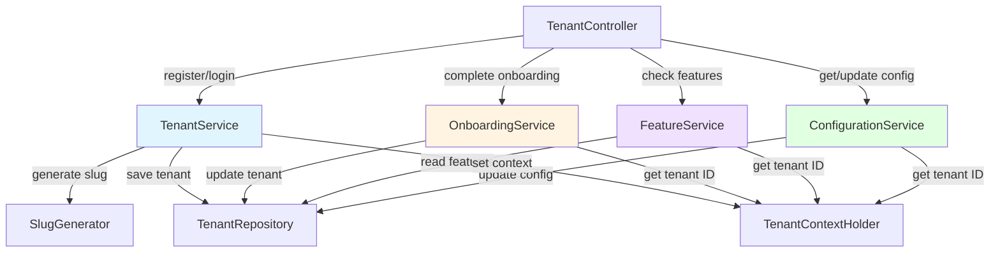

# Design Document: Tenant Authentication

## Overview

This design implements the tenant authentication and management system for a multi-tenant workflow SaaS platform. The system provides secure tenant registration, tenant isolation, onboarding workflows, feature flag management, and tenant configuration. This design focuses on the tenant-specific functionality, while JWT token generation and validation are handled by the jwt-authentication-migration spec.

The system is currently 40% implemented with basic registration and login functionality. This design addresses the missing components: onboarding flow, feature flag management, tenant configuration, and slug generation. The existing plain text password storage issue is being resolved by the jwt-authentication-migration spec.

Key design goals:

- Implement guided onboarding flow for new tenants
- Provide feature flag system for controlling tenant capabilities
- Support tenant-specific configuration management
- Generate unique, URL-safe tenant slugs automatically
- Maintain complete data isolation between tenants
- Follow Spring Boot best practices with constructor injection and package-private visibility

## Architecture

### Component Overview



### Registration and Onboarding Flow

1. **Registration**: User submits organization name, email, and password
2. **Slug Generation**: System generates unique URL-safe slug from organization name
3. **Tenant Creation**: System creates tenant with hashed password, default features, and onboarding_completed=false
4. **Login Response**: System returns tenant data including onboarding_completed status
5. **Frontend Routing**: Frontend checks onboarding_completed and redirects to onboarding page if false
6. **Onboarding Completion**: User completes onboarding steps, system updates onboarding_completed=true
7. **Dashboard Access**: Subsequent logins redirect to dashboard

### Feature Flag Architecture

Feature flags are stored in the tenant's features JSONB column as key-value pairs. The system provides:

- Default feature flags initialized during registration
- Runtime feature checks via FeatureService
- Administrative feature flag updates (future enhancement)
- Fail-safe defaults (missing flags return false)

### Tenant Configuration Architecture

Tenant configuration is stored in a separate configuration JSONB column (to be added). The system provides:

- Schema validation for configuration updates
- Default configuration initialization
- Tenant-scoped configuration access
- Type-safe configuration retrieval

### Data Isolation Strategy

All tenant-scoped operations follow these principles:

1. **Context Extraction**: Get tenant ID from TenantContextHolder (populated by JWT filter)
2. **Validation**: Verify tenant ID is present, throw UnauthorizedException if missing
3. **Scoped Queries**: All repository queries automatically filter by tenant ID
4. **Ownership Verification**: Before updates/deletes, verify entity belongs to current tenant
5. **Context Cleanup**: JWT filter clears context after request completion

## Components and Interfaces

### SlugGenerator

Utility component responsible for generating unique, URL-safe tenant slugs from organization names.

**Responsibilities:**

- Convert organization names to lowercase, URL-safe format
- Replace spaces and special characters with hyphens
- Remove consecutive hyphens and trim leading/trailing hyphens
- Ensure uniqueness by appending numeric suffixes when needed
- Validate slug format matches pattern ^[a-z0-9]+(?:-[a-z0-9]+)*$

**Interface:**

```java
class SlugGenerator {
    String generateSlug(String organizationName, TenantRepository repository);
    private String sanitizeSlug(String input);
    private String ensureUnique(String baseSlug, TenantRepository repository);
}
```

**Algorithm:**

1. Convert input to lowercase
2. Replace non-alphanumeric characters (except hyphens) with hyphens
3. Replace multiple consecutive hyphens with single hyphen
4. Remove leading and trailing hyphens
5. Check uniqueness in database
6. If exists, append "-2", "-3", etc. until unique

**Implementation Notes:**

- Package-private class (no public modifier needed)
- Stateless design - no instance variables
- Uses regex pattern for sanitization: `[^a-z0-9-]+` replaced with `-`
- Uses regex pattern for consecutive hyphens: `-+` replaced with `-`
- Maximum 10 uniqueness attempts before throwing exception

### OnboardingService

Service responsible for managing the tenant onboarding workflow.

**Responsibilities:**

- Mark onboarding as completed for authenticated tenant
- Verify tenant ownership before updating onboarding status
- Provide onboarding status checks
- Handle onboarding-related business logic

**Interface:**

```java
@Service
class OnboardingService {
    void completeOnboarding();
    boolean isOnboardingCompleted();
}
```

**Implementation Notes:**

- Package-private class
- Constructor injection of TenantRepository
- Uses TenantContextHolder to get current tenant ID
- Throws UnauthorizedException if tenant context not set
- Transactional methods with @Transactional annotation
- Read-only queries use @Transactional(readOnly = true)

**Business Rules:**

- Only authenticated tenants can complete onboarding
- Onboarding can be completed multiple times (idempotent operation)
- Onboarding status is included in login response for frontend routing

### FeatureService

Service responsible for managing tenant feature flags.

**Responsibilities:**

- Check if specific features are enabled for current tenant
- Retrieve all feature flags for current tenant
- Provide fail-safe defaults for missing feature flags
- Support future administrative feature flag updates

**Interface:**

```java
@Service
class FeatureService {
    boolean isFeatureEnabled(String featureKey);
    Map<String, Object> getAllFeatures();
}
```

**Implementation Notes:**

- Package-private class
- Constructor injection of TenantRepository
- Uses TenantContextHolder to get current tenant ID
- Returns false for missing or undefined feature flags
- Read-only operations use @Transactional(readOnly = true)

**Default Features:**

The system initializes these default feature flags during registration:

```java
Map<String, Object> defaultFeatures = Map.of(
    "workflow_designer", true,
    "api_access", true,
    "advanced_deployments", false,
    "custom_integrations", false
);
```

**Feature Flag Naming Convention:**

- Use snake_case for feature keys
- Use descriptive names indicating capability
- Boolean values only (true/false)

### ConfigurationService

Service responsible for managing tenant-specific configuration settings.

**Responsibilities:**

- Retrieve tenant configuration
- Update tenant configuration with schema validation
- Initialize default configuration during registration
- Provide type-safe configuration access

**Interface:**

```java
@Service
class ConfigurationService {
    Map<String, Object> getConfiguration();
    void updateConfiguration(Map<String, Object> configuration);
    private void validateConfiguration(Map<String, Object> configuration);
}
```

**Implementation Notes:**

- Package-private class
- Constructor injection of TenantRepository
- Uses TenantContextHolder to get current tenant ID
- Validates configuration schema before updates
- Throws BadRequestException for invalid configuration
- Transactional updates with @Transactional annotation

**Default Configuration:**

```java
Map<String, Object> defaultConfiguration = Map.of(
    "timezone", "UTC",
    "date_format", "YYYY-MM-DD",
    "workflow_timeout_minutes", 60
);
```

**Configuration Schema Validation:**

- Validate required keys are present
- Validate value types match expected types
- Validate value ranges for numeric settings
- Return detailed error messages for validation failures

### TenantService Updates

The existing TenantService requires updates to integrate slug generation and default initialization.

**Updated Responsibilities:**

- Generate unique slug during registration
- Initialize default features during registration
- Initialize default configuration during registration
- Remove onboarding completion logic (moved to OnboardingService)
- Integrate with JWT token generation (handled by jwt-authentication-migration)

**Updated Interface:**

```java
@Service
class TenantService {
    private final TenantRepository tenantRepository;
    private final SlugGenerator slugGenerator;
    
    AuthResponse register(RegisterRequest request);
    AuthResponse login(LoginRequest request);
    TenantResponse getCurrentTenant();
}
```

**Registration Flow Updates:**

1. Validate email uniqueness
2. Generate slug from organization name
3. Create tenant entity with:
   - Generated slug
   - Hashed password (via jwt-authentication-migration)
   - Default features map
   - Default configuration map
   - onboarding_completed = false
4. Save tenant to database
5. Set tenant context
6. Return AuthResponse with JWT token

### TenantController

REST controller exposing tenant management endpoints.

**Responsibilities:**

- Handle HTTP requests for tenant operations
- Validate request DTOs
- Delegate business logic to service layer
- Return appropriate HTTP status codes

**Endpoints:**

```java
@RestController
@RequestMapping("/api/auth")
class TenantController {
    
    @PostMapping("/register")
    ResponseEntity<AuthResponse> register(@Valid @RequestBody RegisterRequest request);
    
    @PostMapping("/login")
    ResponseEntity<AuthResponse> login(@Valid @RequestBody LoginRequest request);
    
    @GetMapping("/me")
    ResponseEntity<TenantResponse> getCurrentTenant();
    
    @PostMapping("/onboarding/complete")
    ResponseEntity<Void> completeOnboarding();
    
    @GetMapping("/features")
    ResponseEntity<Map<String, Object>> getFeatures();
    
    @GetMapping("/features/{featureKey}")
    ResponseEntity<Boolean> isFeatureEnabled(@PathVariable String featureKey);
    
    @GetMapping("/configuration")
    ResponseEntity<Map<String, Object>> getConfiguration();
    
    @PutMapping("/configuration")
    ResponseEntity<Void> updateConfiguration(@Valid @RequestBody ConfigurationRequest request);
}
```

**Implementation Notes:**

- Package-private class
- Constructor injection of services
- Use @Valid for request validation
- Return ResponseEntity with appropriate status codes
- Use @Transactional at service layer, not controller layer

## Data Models

### Tenant Entity

The Tenant entity represents an isolated customer organization with authentication credentials and configuration.

**Current Structure:**

```java
@Entity
@Table(name = "tenants")
@Data
class Tenant {
    @Id
    @GeneratedValue(strategy = GenerationType.UUID)
    private UUID id;
    
    @Column(nullable = false)
    private String name;
    
    @Column(nullable = false, unique = true, length = 100)
    private String slug;
    
    @Column(nullable = false, unique = true)
    private String email;
    
    @Column(name = "password_hash", nullable = false)
    private String passwordHash;
    
    @JdbcTypeCode(SqlTypes.JSON)
    @Column(columnDefinition = "jsonb")
    private Map<String, Object> features = new HashMap<>();
    
    @Column(name = "onboarding_completed")
    private Boolean onboardingCompleted = false;
    
    @Column(name = "created_at", updatable = false)
    private LocalDateTime createdAt;
    
    @Column(name = "updated_at")
    private LocalDateTime updatedAt;
}
```

**Required Updates:**

Add configuration column:

```java
@JdbcTypeCode(SqlTypes.JSON)
@Column(columnDefinition = "jsonb")
private Map<String, Object> configuration = new HashMap<>();
```

**Database Migration:**

```yaml
- changeSet:
    id: add-tenant-configuration
    author: system
    changes:
      - addColumn:
          tableName: tenants
          columns:
            - column:
                name: configuration
                type: jsonb
                defaultValue: '{}'
```

### RegisterRequest DTO

Request object for tenant registration.

**Current Structure:**

```java
record RegisterRequest(
    @NotBlank String name,
    @NotBlank String slug,
    @NotBlank @Email String email,
    @NotBlank @Size(min = 8) String password
) {}
```

**Updated Structure:**

Remove slug field (auto-generated):

```java
record RegisterRequest(
    @NotBlank String name,
    @NotBlank @Email String email,
    @NotBlank @Size(min = 8) String password
) {}
```

**Validation Rules:**

- name: Required, non-blank
- email: Required, valid email format
- password: Required, minimum 8 characters

### TenantResponse DTO

Response object containing tenant information.

**Current Structure:**

```java
record TenantResponse(
    UUID id,
    String name,
    String slug,
    String email,
    Map<String, Object> features,
    Boolean onboardingCompleted
) {}
```

**Updated Structure:**

Add configuration field:

```java
record TenantResponse(
    UUID id,
    String name,
    String slug,
    String email,
    Map<String, Object> features,
    Map<String, Object> configuration,
    Boolean onboardingCompleted
) {}
```

### ConfigurationRequest DTO

Request object for updating tenant configuration.

**Structure:**

```java
record ConfigurationRequest(
    @NotNull Map<String, Object> configuration
) {}
```

**Validation:**

- configuration: Required, non-null map
- Additional schema validation performed by ConfigurationService

### Feature Flag Structure

Feature flags are stored as JSON in the features column.

**Example:**

```json
{
  "workflow_designer": true,
  "api_access": true,
  "advanced_deployments": false,
  "custom_integrations": false
}
```

**Type Constraints:**

- Keys: String (snake_case naming convention)
- Values: Boolean only

### Configuration Structure

Tenant configuration is stored as JSON in the configuration column.

**Example:**

```json
{
  "timezone": "UTC",
  "date_format": "YYYY-MM-DD",
  "workflow_timeout_minutes": 60
}
```

**Type Constraints:**

- Keys: String (snake_case naming convention)
- Values: String, Number, or Boolean

### Slug Format

Tenant slugs follow a strict format for URL safety.

**Pattern:** `^[a-z0-9]+(?:-[a-z0-9]+)*$`

**Examples:**

- Valid: `acme-corp`, `my-company-123`, `test`
- Invalid: `Acme-Corp` (uppercase), `my--company` (consecutive hyphens), `-test` (leading hyphen)

**Uniqueness:**

- Slugs must be unique across all tenants
- Numeric suffixes ensure uniqueness: `acme-corp`, `acme-corp-2`, `acme-corp-3`

### Database Schema

**Tenants Table:**

```sql
CREATE TABLE tenants (
    id UUID PRIMARY KEY DEFAULT gen_random_uuid(),
    name VARCHAR(255) NOT NULL,
    slug VARCHAR(100) NOT NULL UNIQUE,
    email VARCHAR(255) NOT NULL UNIQUE,
    password_hash VARCHAR(255) NOT NULL,
    features JSONB DEFAULT '{}',
    configuration JSONB DEFAULT '{}',
    onboarding_completed BOOLEAN DEFAULT FALSE,
    created_at TIMESTAMP NOT NULL DEFAULT CURRENT_TIMESTAMP,
    updated_at TIMESTAMP NOT NULL DEFAULT CURRENT_TIMESTAMP
);

CREATE INDEX idx_tenants_email ON tenants(email);
CREATE INDEX idx_tenants_slug ON tenants(slug);
```

**Tenant-Scoped Tables:**

All tenant-scoped tables include tenant_id foreign key:

```sql
CREATE TABLE apps (
    id UUID PRIMARY KEY DEFAULT gen_random_uuid(),
    tenant_id UUID NOT NULL REFERENCES tenants(id) ON DELETE CASCADE,
    name VARCHAR(255) NOT NULL,
    -- other columns
    CONSTRAINT unique_app_name_per_tenant UNIQUE (tenant_id, name)
);

CREATE INDEX idx_apps_tenant_id ON apps(tenant_id);
```

**Isolation Pattern:**

- Every tenant-scoped table has tenant_id column
- Foreign key constraint ensures referential integrity
- Index on tenant_id optimizes tenant-scoped queries
- Unique constraints include tenant_id for tenant-scoped uniqueness

## Correctness Properties

A property is a characteristic or behavior that should hold true across all valid executions of a system-essentially, a formal statement about what the system should do. Properties serve as the bridge between human-readable specifications and machine-verifiable correctness guarantees.

### Property 1: Email Uniqueness Validation

For any registration request with an email that already exists in the database, the registration service SHALL reject the request and return an error indicating the email is in use.

**Validates: Requirements 1.1, 1.2**

### Property 2: Registration Initialization

For any valid registration request, when a tenant account is created, the system SHALL initialize the tenant with onboarding_completed set to false, a non-empty default features map, and a non-empty default configuration map.

**Validates: Requirements 1.5, 1.6, 8.2**

### Property 3: Password Hash Exclusion

For any registration or login response, the response SHALL never contain the password_hash field or any password-related data.

**Validates: Requirements 1.7, 9.4**

### Property 4: Slug Sanitization and Format

For any organization name, when generating a tenant slug, the resulting slug SHALL be lowercase, contain only alphanumeric characters and hyphens, have no consecutive hyphens, have no leading or trailing hyphens, and match the pattern ^[a-z0-9]+(?:-[a-z0-9]+)*$.

**Validates: Requirements 10.2, 10.3, 10.4, 10.6**

### Property 5: Slug Uniqueness Enforcement

For any organization name that would generate a slug that already exists, the slug generator SHALL append a numeric suffix (starting with -2) to ensure the resulting slug is unique in the database.

**Validates: Requirements 10.5**

### Property 6: Thread-Local Tenant Context Isolation

For any set of concurrent requests with different tenant contexts, each thread SHALL maintain its own isolated tenant ID in TenantContextHolder with no cross-contamination between threads.

**Validates: Requirements 4.2**

### Property 7: Repository Query Tenant Filtering

For any repository query executed with a tenant context set, the query results SHALL only include entities belonging to the current tenant ID from TenantContextHolder.

**Validates: Requirements 5.2**

### Property 8: Automatic Tenant ID Assignment

For any entity creation operation, when a tenant context is set, the service layer SHALL automatically assign the current tenant ID from TenantContextHolder to the entity's tenant_id field before saving.

**Validates: Requirements 5.3**

### Property 9: Cross-Tenant Ownership Verification

For any update or delete operation on a tenant-scoped entity, the service layer SHALL verify the entity's tenant_id matches the current tenant ID from TenantContextHolder before applying the operation, and SHALL throw ResourceNotFoundException if the tenant IDs do not match.

**Validates: Requirements 5.4, 5.5, 5.6, 6.4, 8.5**

### Property 10: Onboarding Status in Login Response

For any tenant with onboarding_completed set to false, when the tenant logs in, the authentication response SHALL include the onboarding_completed field with value false.

**Validates: Requirements 6.1**

### Property 11: Onboarding Completion Update

For any authenticated tenant, when the onboarding completion endpoint is called, the system SHALL update the tenant's onboarding_completed field to true in the database.

**Validates: Requirements 6.3**

### Property 12: Feature Flag Retrieval

For any feature key that exists in a tenant's features map, when checking if the feature is enabled, the FeatureService SHALL return the boolean value stored in the tenant's features configuration.

**Validates: Requirements 7.3**

### Property 13: Missing Feature Flag Default

For any feature key that does not exist in a tenant's features map, when checking if the feature is enabled, the FeatureService SHALL return false as the default value.

**Validates: Requirements 7.4**

### Property 14: Configuration Schema Validation

For any configuration update request with invalid schema (missing required keys, invalid value types, or out-of-range values), the ConfigurationService SHALL reject the update and throw BadRequestException with specific validation error details.

**Validates: Requirements 8.3, 8.4**

### Property 15: Cross-Tenant Access Logging

For any cross-tenant access attempt (when an entity's tenant_id does not match the current tenant context), the service layer SHALL log a security violation message containing both tenant IDs and the requested resource identifier.

**Validates: Requirements 12.5**

## Error Handling

### Exception Hierarchy

The tenant authentication system uses Spring Boot's exception handling with custom exceptions:

**Service Layer Exceptions:**

- `BadRequestException`: Thrown for invalid input data (duplicate email, duplicate slug, invalid configuration)
- `UnauthorizedException`: Thrown when tenant context is missing or authentication fails
- `ResourceNotFoundException`: Thrown when requested entity doesn't exist or belongs to different tenant

**Exception Messages:**

- Duplicate email: "Email already exists"
- Duplicate slug: "Slug already exists"
- Missing tenant context: "Authentication required"
- Cross-tenant access: "Resource not found" (don't expose that resource exists for different tenant)
- Invalid configuration: "Invalid configuration: {specific field errors}"

### Global Exception Handler

The existing `@RestControllerAdvice` handles exceptions and returns consistent error responses:

```java
@ExceptionHandler(BadRequestException.class)
ResponseEntity<ErrorResponse> handleBadRequest(BadRequestException e) {
    return ResponseEntity.status(HttpStatus.BAD_REQUEST)
        .body(new ErrorResponse("BAD_REQUEST", e.getMessage()));
}

@ExceptionHandler(UnauthorizedException.class)
ResponseEntity<ErrorResponse> handleUnauthorized(UnauthorizedException e) {
    return ResponseEntity.status(HttpStatus.UNAUTHORIZED)
        .body(new ErrorResponse("UNAUTHORIZED", e.getMessage()));
}

@ExceptionHandler(ResourceNotFoundException.class)
ResponseEntity<ErrorResponse> handleNotFound(ResourceNotFoundException e) {
    return ResponseEntity.status(HttpStatus.NOT_FOUND)
        .body(new ErrorResponse("NOT_FOUND", e.getMessage()));
}
```

### Error Response Format

All error responses follow a consistent structure:

```json
{
  "error": "BAD_REQUEST",
  "message": "Email already exists"
}
```

### Validation Errors

Request validation errors (from `@Valid` annotations) are handled by Spring's default validation:

```json
{
  "error": "VALIDATION_FAILED",
  "message": "Validation failed",
  "fields": {
    "email": "must be a well-formed email address",
    "password": "size must be between 8 and 2147483647"
  }
}
```

### Security Considerations

**Cross-Tenant Access Prevention:**

- Never expose that a resource exists for a different tenant
- Always return 404 Not Found (not 403 Forbidden) for cross-tenant access
- Log security violations for monitoring and audit

**Information Disclosure Prevention:**

- Use generic error messages for authentication failures
- Don't indicate whether email exists during login
- Don't expose password hashes in any response
- Don't expose internal implementation details in error messages

### Startup Validation

The application validates configuration during startup:

**Database Connection:**

- Fail fast if database connection cannot be established
- Log clear error message with connection details (excluding password)

**Required Configuration:**

- Validate JWT_SECRET is configured (handled by jwt-authentication-migration)
- Validate database URL is configured
- Fail fast with clear error messages if configuration is missing

## Testing Strategy

### Dual Testing Approach

The tenant authentication system requires both unit tests and property-based tests for comprehensive coverage:

**Unit Tests:**

- Specific examples demonstrating correct behavior
- Integration tests with Spring Boot test context
- Edge cases (empty inputs, boundary conditions, null values)
- Error conditions (duplicate emails, missing tenant context, cross-tenant access)
- Database interactions with H2 in-memory database

**Property-Based Tests:**

- Universal properties holding across all inputs
- Slug generation with random organization names
- Tenant isolation with concurrent access
- Feature flag behavior with random feature keys
- Configuration validation with random invalid inputs

### Property-Based Testing Configuration

**Library:** jqwik 1.8.2 (already in pom.xml)

**Configuration:**

- Minimum 100 iterations per property test (due to randomization)
- Each test tagged with feature name and property number
- Tag format: `@Tag("Feature: tenant-authentication, Property {number}: {property_text}")`

**Example Property Test:**

```java
@Property
@Tag("Feature: tenant-authentication, Property 4: Slug Sanitization and Format")
void slugSanitizationProducesValidFormat(
    @ForAll @AlphaChars @StringLength(min = 1, max = 50) String orgName
) {
    String slug = slugGenerator.generateSlug(orgName, tenantRepository);
    
    // Verify format
    assertTrue(slug.matches("^[a-z0-9]+(?:-[a-z0-9]+)*$"));
    assertFalse(slug.contains("--"));
    assertFalse(slug.startsWith("-"));
    assertFalse(slug.endsWith("-"));
}
```

### Unit Test Coverage

**SlugGenerator Tests:**

- Generate slug from simple organization name
- Generate slug with uppercase letters (verify lowercase conversion)
- Generate slug with spaces (verify hyphen replacement)
- Generate slug with special characters (verify hyphen replacement)
- Generate slug with consecutive spaces (verify single hyphen)
- Generate slug with leading/trailing spaces (verify trimming)
- Generate slug when base slug exists (verify numeric suffix)
- Generate slug when multiple suffixes exist (verify correct increment)

**OnboardingService Tests:**

- Complete onboarding for authenticated tenant
- Complete onboarding updates onboarding_completed to true
- Complete onboarding throws UnauthorizedException when tenant context not set
- Check onboarding status returns correct value
- Onboarding completion is idempotent (can be called multiple times)

**FeatureService Tests:**

- Check enabled feature returns true
- Check disabled feature returns false
- Check missing feature returns false (default)
- Get all features returns complete features map
- Feature check requires tenant context (throws UnauthorizedException if not set)

**ConfigurationService Tests:**

- Get configuration returns tenant's configuration
- Update configuration with valid data succeeds
- Update configuration with invalid schema throws BadRequestException
- Update configuration validates required keys
- Update configuration validates value types
- Update configuration validates value ranges
- Configuration operations require tenant context

**TenantService Tests:**

- Register with valid data creates tenant
- Register generates unique slug
- Register initializes default features
- Register initializes default configuration
- Register sets onboarding_completed to false
- Register with duplicate email throws BadRequestException
- Register returns response without password hash
- Login returns onboarding status
- Get current tenant requires authentication

**TenantController Tests:**

- POST /api/auth/register with valid data returns 200
- POST /api/auth/register with duplicate email returns 400
- POST /api/auth/register with invalid email returns 400
- POST /api/auth/register with short password returns 400
- GET /api/auth/me requires authentication (returns 401 without token)
- GET /api/auth/me returns tenant data for authenticated user
- POST /api/auth/onboarding/complete requires authentication
- POST /api/auth/onboarding/complete returns 200
- GET /api/auth/features requires authentication
- GET /api/auth/features/{key} returns boolean
- GET /api/auth/configuration requires authentication
- PUT /api/auth/configuration with valid data returns 200
- PUT /api/auth/configuration with invalid data returns 400

### Integration Test Strategy

**Spring Boot Test Configuration:**

```java
@SpringBootTest(webEnvironment = SpringBootTest.WebEnvironment.RANDOM_PORT)
@AutoConfigureMockMvc
class TenantAuthenticationIntegrationTest {
    @Autowired
    private MockMvc mockMvc;
    
    @Autowired
    private TenantRepository tenantRepository;
    
    @Test
    void registrationFlowCreatesCompletelyInitializedTenant() throws Exception {
        RegisterRequest request = new RegisterRequest(
            "Test Company",
            "test@example.com",
            "password123"
        );
        
        mockMvc.perform(post("/api/auth/register")
                .contentType(MediaType.APPLICATION_JSON)
                .content(objectMapper.writeValueAsString(request)))
            .andExpect(status().isOk())
            .andExpect(jsonPath("$.tenant.slug").exists())
            .andExpect(jsonPath("$.tenant.onboardingCompleted").value(false))
            .andExpect(jsonPath("$.tenant.features").isNotEmpty())
            .andExpect(jsonPath("$.tenant.configuration").isNotEmpty())
            .andExpect(jsonPath("$.token").exists());
        
        // Verify database state
        Tenant tenant = tenantRepository.findByEmail("test@example.com").orElseThrow();
        assertFalse(tenant.getOnboardingCompleted());
        assertFalse(tenant.getFeatures().isEmpty());
        assertFalse(tenant.getConfiguration().isEmpty());
    }
}
```

**Test Database:**

- Use H2 in-memory database for tests (already configured)
- Each test method runs in a transaction (rollback after test)
- Use `@Sql` annotations to set up test data when needed
- Use Testcontainers for PostgreSQL integration tests (optional)

**Tenant Isolation Tests:**

```java
@Test
void tenantCanOnlyAccessOwnData() {
    // Create two tenants
    Tenant tenant1 = createTenant("tenant1@example.com");
    Tenant tenant2 = createTenant("tenant2@example.com");
    
    // Set tenant1 context
    TenantContextHolder.setTenantId(tenant1.getId());
    
    // Verify tenant1 can access own data
    TenantResponse response = tenantService.getCurrentTenant();
    assertEquals(tenant1.getId(), response.id());
    
    // Verify tenant1 cannot access tenant2's data by manipulating context
    TenantContextHolder.setTenantId(tenant2.getId());
    response = tenantService.getCurrentTenant();
    assertEquals(tenant2.getId(), response.id());
    
    TenantContextHolder.clear();
}
```

**Concurrency Tests:**

```java
@Property(tries = 100)
@Tag("Feature: tenant-authentication, Property 6: Thread-Local Tenant Context Isolation")
void concurrentRequestsIsolateTenantContext(
    @ForAll @Size(min = 5, max = 20) List<UUID> tenantIds
) throws Exception {
    ExecutorService executor = Executors.newFixedThreadPool(10);
    
    List<Future<UUID>> futures = tenantIds.stream()
        .map(tenantId -> executor.submit(() -> {
            TenantContextHolder.setTenantId(tenantId);
            UUID retrieved = TenantContextHolder.getTenantId();
            TenantContextHolder.clear();
            return retrieved;
        }))
        .toList();
    
    // Verify each thread got correct tenant ID
    for (int i = 0; i < tenantIds.size(); i++) {
        assertEquals(tenantIds.get(i), futures.get(i).get());
    }
    
    executor.shutdown();
}
```

### Test Data Generators

**jqwik Arbitraries:**

```java
@Provide
Arbitrary<String> organizationNames() {
    return Arbitraries.strings()
        .withCharRange('a', 'z')
        .withCharRange('A', 'Z')
        .withCharRange('0', '9')
        .withChars(' ', '-', '_', '&', '.')
        .ofMinLength(1)
        .ofMaxLength(50);
}

@Provide
Arbitrary<String> emails() {
    return Arbitraries.strings()
        .withCharRange('a', 'z')
        .ofMinLength(3)
        .ofMaxLength(10)
        .map(s -> s + "@example.com");
}

@Provide
Arbitrary<Map<String, Object>> invalidConfigurations() {
    return Arbitraries.of(
        Map.of("timezone", 123),  // Wrong type
        Map.of("workflow_timeout_minutes", -1),  // Out of range
        Map.of(),  // Missing required keys
        Map.of("unknown_key", "value")  // Unknown key
    );
}
```

### Logging Verification

**Test Logging Configuration:**

Use Logback test configuration to capture log output for security violation tests:

```java
@Test
void crossTenantAccessAttemptIsLogged() {
    Tenant tenant1 = createTenant("tenant1@example.com");
    Tenant tenant2 = createTenant("tenant2@example.com");
    
    // Create entity for tenant1
    TenantContextHolder.setTenantId(tenant1.getId());
    App app = createApp("Test App");
    
    // Try to access from tenant2 context
    TenantContextHolder.setTenantId(tenant2.getId());
    
    assertThrows(ResourceNotFoundException.class, () -> {
        appService.getApp(app.getId());
    });
    
    // Verify security violation was logged
    assertThat(logCaptor.getWarnLogs())
        .anyMatch(log -> log.contains("Cross-tenant access attempt") 
            && log.contains(tenant2.getId().toString())
            && log.contains(app.getId().toString()));
    
    TenantContextHolder.clear();
}
```

### Test Execution

**Run all tests:**

```bash
mvn test
```

**Run specific test class:**

```bash
mvn test -Dtest=SlugGeneratorTest
```

**Run property-based tests only:**

```bash
mvn test -Dgroups="property-based"
```

**Test coverage goal:** Minimum 80% line coverage for tenant authentication components (TenantService, OnboardingService, FeatureService, ConfigurationService, SlugGenerator).
