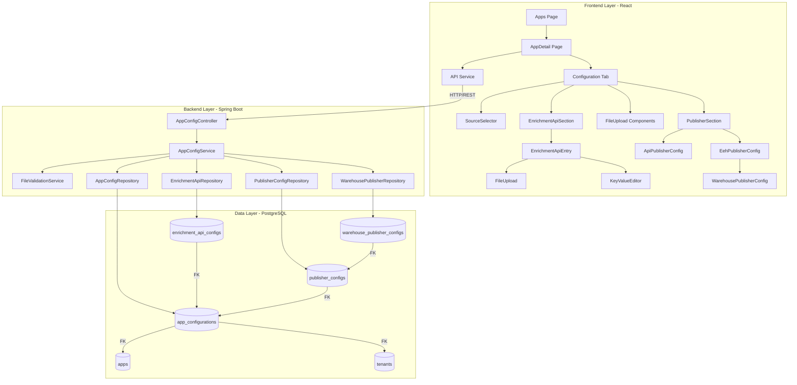
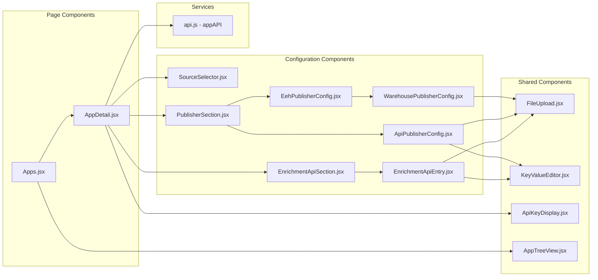
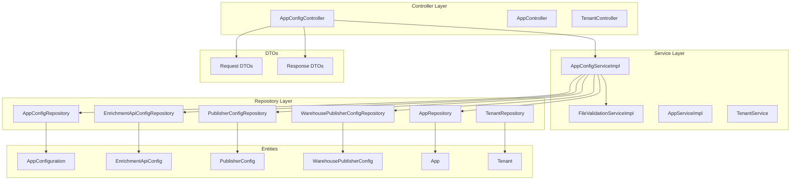
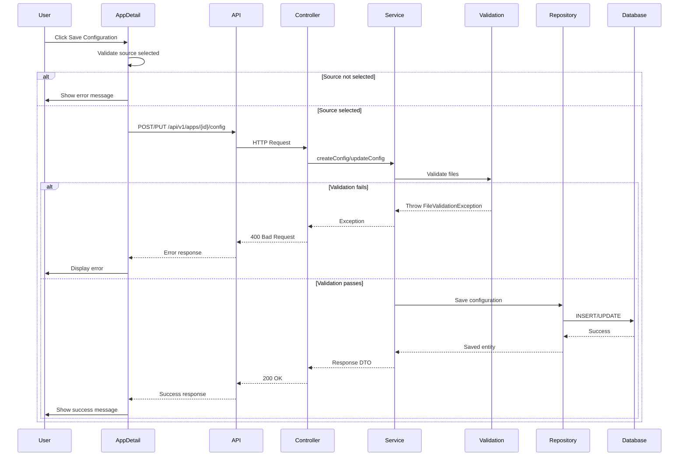
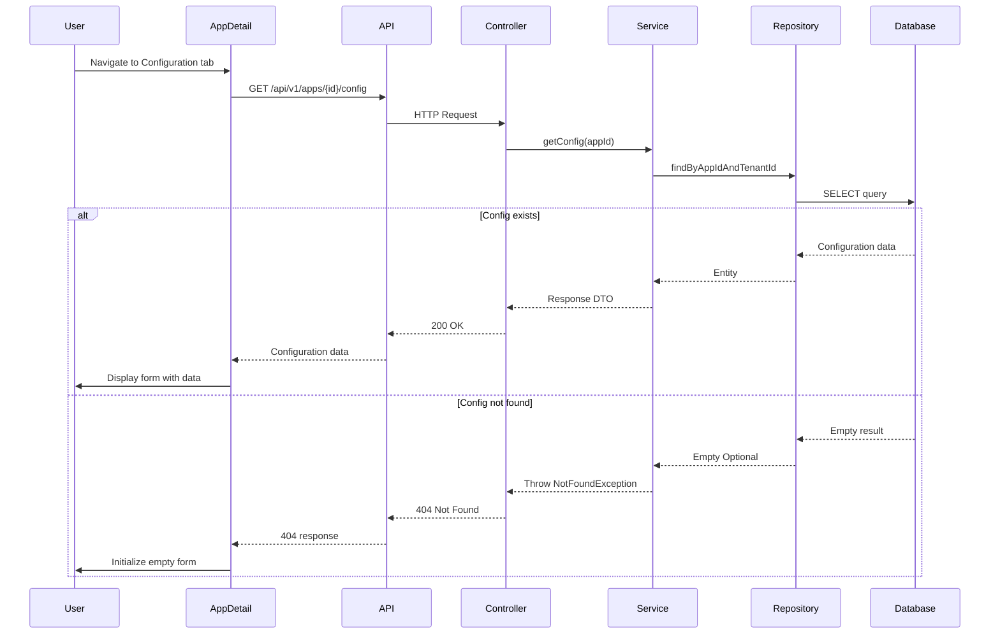
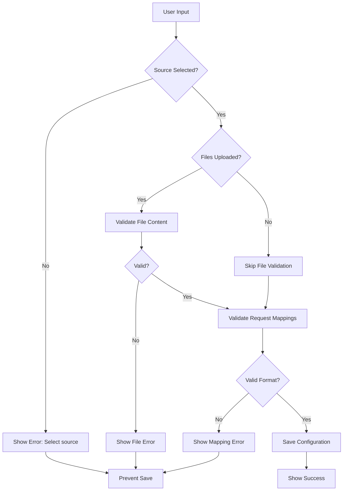
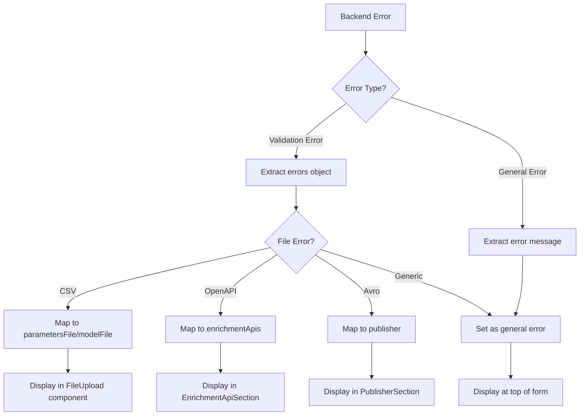
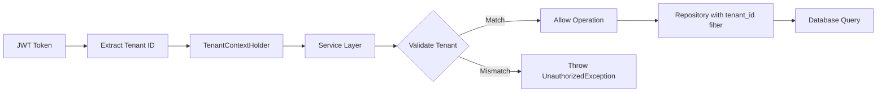

# App Configuration Management - Component Diagram

## System Architecture Overview



## Detailed Component Breakdown

### Frontend Components



### Backend Components



## Data Flow Diagrams

### Configuration Save Flow



### Configuration Load Flow



## Component Responsibilities

### Frontend Components

| Component | Responsibility |
|-----------|---------------|
| **Apps.jsx** | List all apps, create new apps, navigate to app details |
| **AppDetail.jsx** | Main page for app management, tab navigation, state management |
| **SourceSelector.jsx** | Dropdown for selecting data source (EEH/API) |
| **EnrichmentApiSection.jsx** | Container for enrichment API entries, add/remove logic |
| **EnrichmentApiEntry.jsx** | Single enrichment API configuration form |
| **PublisherSection.jsx** | Publisher type selection and configuration |
| **ApiPublisherConfig.jsx** | API publisher configuration form |
| **EehPublisherConfig.jsx** | EEH publisher wrapper |
| **WarehousePublisherConfig.jsx** | Warehouse publisher configuration form |
| **FileUpload.jsx** | Reusable file upload with validation display |
| **KeyValueEditor.jsx** | Dynamic key-value pair editor |
| **ApiKeyDisplay.jsx** | Display, copy, and regenerate API keys |
| **AppTreeView.jsx** | Hierarchical tree view of apps and workflows |

### Backend Components

| Component | Responsibility |
|-----------|---------------|
| **AppConfigController** | REST endpoints for configuration CRUD operations |
| **AppConfigServiceImpl** | Business logic, validation orchestration, tenant isolation |
| **FileValidationServiceImpl** | Validate OpenAPI, Avro, CSV, request mappings |
| **AppConfigRepository** | Data access for app configurations |
| **EnrichmentApiConfigRepository** | Data access for enrichment API configs |
| **PublisherConfigRepository** | Data access for publisher configs |
| **WarehousePublisherConfigRepository** | Data access for warehouse publisher configs |

### Database Tables

| Table | Purpose |
|-------|---------|
| **app_configurations** | Main configuration data (source, files) |
| **enrichment_api_configs** | Enrichment API configurations (OpenAPI, mappings) |
| **publisher_configs** | Publisher configurations (type, OpenAPI, mappings) |
| **warehouse_publisher_configs** | Warehouse-specific publisher data (Avro schema) |
| **apps** | Application containers |
| **tenants** | Multi-tenant isolation |

## API Endpoints

```
GET    /api/v1/apps/{appId}/config
POST   /api/v1/apps/{appId}/config
PUT    /api/v1/apps/{appId}/config
DELETE /api/v1/apps/{appId}/config/enrichment-apis/{id}
DELETE /api/v1/apps/{appId}/config/publisher
```

## Validation Flow



## Error Handling Flow



## Technology Stack

### Frontend
- React 18.2.0
- React Router 6.20.1
- Axios for HTTP
- Vite 5.0.8 (build tool)
- Vitest (testing)
- @testing-library/react (component testing)

### Backend
- Java 17
- Spring Boot 3.1.5
- Spring Data JPA
- PostgreSQL 15
- Liquibase (migrations)
- Lombok (boilerplate reduction)
- jqwik (property-based testing)

### Infrastructure
- Docker Compose
- PostgreSQL 15 (Alpine)

## Multi-Tenancy

All operations are tenant-scoped:



## Key Design Patterns

1. **Repository Pattern** - Data access abstraction
2. **Service Layer Pattern** - Business logic separation
3. **DTO Pattern** - Request/Response separation from entities
4. **Component Composition** - Reusable React components
5. **Controlled Components** - React form state management
6. **Constructor Injection** - Spring dependency injection
7. **Multi-Tenancy** - Tenant isolation at all layers
